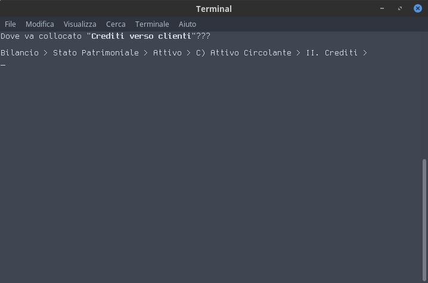

# Colloca in bilancio

Software da riga di comando per memorizzare la struttura [dello schema di bilancio italiano](https://it.wikipedia.org/wiki/File:Schemi_di_Bilancio.pdf)



**Attenzione**: il software è ancora in fase di sviluppo, pertanto non mi assumo alcuna responsabilità riguardo al suo funzionamento e/o eventuali errori contenuti nel file [schemi_di_bilancio.moon](schemi_di_bilancio.moon).

Ogni suggerimento e correzione è ben accetto, e può essere effettuato tramite _github_ oppure all'indirizzo email `Gianluca.Mondini` _chiocciola_ `outlook . it`

## Dipendenze

- [Lua](https://www.lua.org/)
- [Moonscript](https://moonscript.org/)

## Installazione

```bash
git clone https://github.com/zapateo/CollocaInBilancio
```

## Esecuzione

```bash
CollocaInBilancio/run.sh
```

Una volta avviato, premi INVIO per avanzare, CTRL-C per uscire
